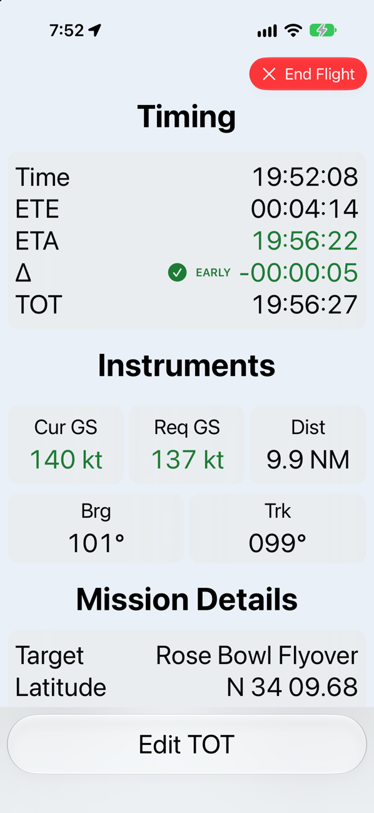
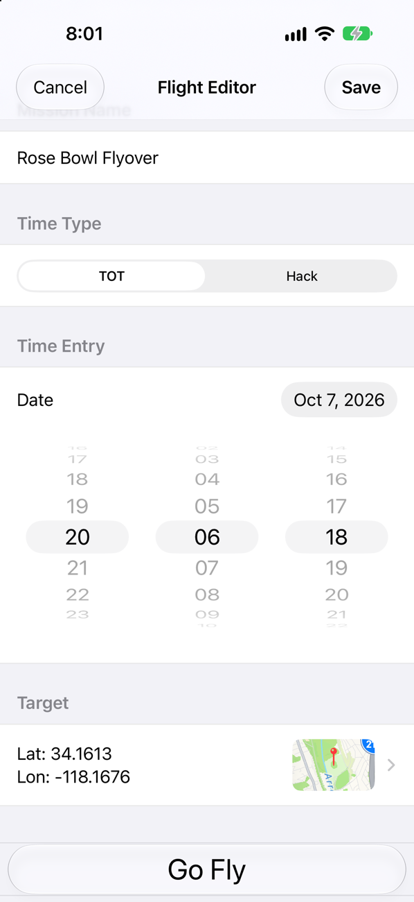
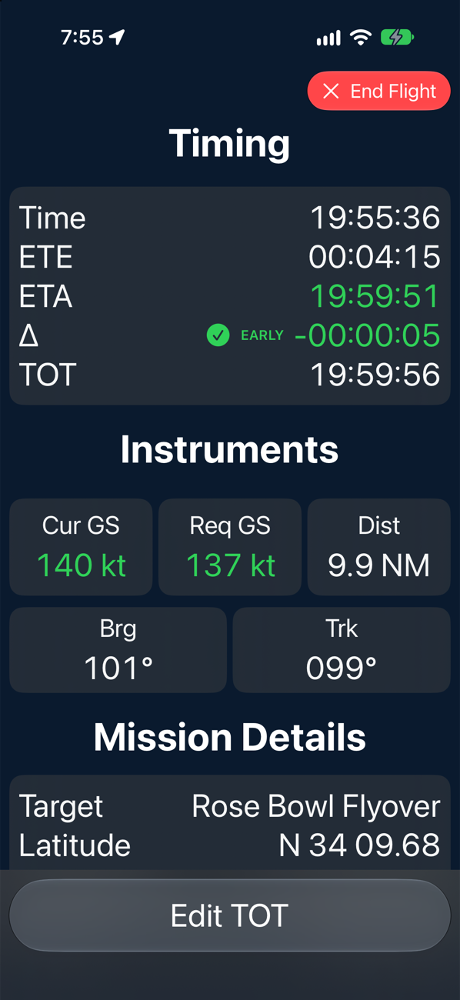

# Formation Flight

A free iOS timing aid for GA pilots flying time-on-target (TOT) and hack-time missions. Pick a target and a time, and Formation Flight uses the device's GPS to show time to go, ETA, how early or late you are, and the groundspeed you need to arrive on time.

**Coming soon to the App Store.** Free, with no ads, no account and no in-app purchases. Read more on the [project site](https://ellisandy.github.io/FormationFlight/).

<p align="center">
  
  
  
</p>

> [!WARNING]
> Formation Flight is a supplemental situational-awareness tool. It is **not** a certified navigation system and must not be used as a primary means of navigation, terrain avoidance, or traffic separation. Always fly the aircraft first and cross-check against your primary instruments.

## Why it exists

My brother and his friends fly community flyovers eight to ten times a year: parades, ballgames, Memorial Day ceremonies. The goal is to cross the crowd right as the music on the ground hits its mark. With a stopwatch and mental math he was landing within about ±20 seconds. He asked me for something that would just tell him whether he was early or late and how fast to fly to fix it. With Formation Flight he's within a second or two.

## Features

- Time, ETE, ETA, and an early/late Δ against the TOT, colour-coded against tolerances you set
- Time-on-target missions flown to a clock time, or hack missions flown to a countdown started with **Hack!**
- Current groundspeed and the groundspeed required to make the TOT
- Distance and bearing to the target, plus current track
- ETE modelled as a standard-rate turn onto the target followed by straight flight
- Targets picked on a satellite map or entered as coordinates; flights saved ahead of time
- TOT editable mid-flight
- Choice of speed and distance units, and of which instruments to show
- Large, high-contrast readouts in light and dark mode; the screen stays awake during a flight
- No account, no network access, no data collection. Location never leaves the device.

## In progress

- Voice callouts
- Apple Watch companion app
- Notifications

## Requirements

| Item | Version |
|---|---|
| Xcode | 26 or later |
| iOS / iPadOS | 26.0 or later |
| Swift | 6 |
| Dependencies | None (Apple frameworks only) |

## Getting started

```sh
git clone https://github.com/ellisandy/FormationFlight.git
cd FormationFlight
open "Formation Flight.xcodeproj"
```

1. Select the **Formation Flight** scheme and an iPhone simulator.
2. Press **⌘R** to build and run.
3. To see live readouts on the simulator, give it a location: in the simulator choose **Features ▸ Location**, or in Xcode choose **Debug ▸ Simulate Location** and pick `TestFlight1.gpx` (in `Formation FlightUITests/TestAssets/`).

### Running on a physical device

The project is configured with the maintainer's signing team and bundle identifier. To install on your own device:

1. Select the **Formation Flight** target ▸ **Signing & Capabilities**.
2. Choose your own **Team**.
3. Change the **Bundle Identifier** to something unique, e.g. `com.yourname.FormationFlight`.

Please don't commit these signing changes in pull requests.

## Running the tests

Press **⌘U**, or from the command line:

```sh
xcodebuild test \
  -project "Formation Flight.xcodeproj" \
  -scheme "Formation Flight" \
  -destination "platform=iOS Simulator,name=iPhone 17"
```

The `Formation Flight.xctestplan` test plan runs two targets:

- **Formation FlightTests** — unit tests written with [Swift Testing](https://developer.apple.com/documentation/testing).
- **Formation FlightUITests** — UI tests written with XCUIAutomation. The plan simulates location with `TestFlight1.gpx`.

## Project layout

```
Formation Flight/
├── Core/
│   ├── Domain/        Flight, Target, Settings, turn-to-target geometry
│   ├── Extensions/    CLLocation, Date and Double helpers
│   ├── Location/      LocationProvider (Core Location wrapper)
│   ├── UI Shared/     Reusable views, formatters, design tokens
│   └── Utilities/     Logging
├── Features/
│   ├── Home/            Flights list
│   ├── FlightEditor/    Create and edit a flight
│   ├── FlightView/      In-flight instruments
│   └── SettingsEditor/  Units and tolerances
└── Shared Assets/     Asset catalog, Info.plist, string catalog, privacy manifest
Formation FlightTests/   Unit tests (mirrors the app's folder layout)
Formation FlightUITests/ UI tests
docs/                    Support site, privacy policy, design decisions
```

Features follow a SwiftUI view + view-model pattern. The project uses Xcode synchronized folders, so adding a file to a folder on disk adds it to the target.

## Documentation

- [Support page](https://ellisandy.github.io/FormationFlight/) and [privacy policy](https://ellisandy.github.io/FormationFlight/privacy/), published from `docs/` with GitHub Pages
- [Design decisions](docs/decisions/) — the reasoning behind non-obvious navigation behaviour
- [BACKLOG.md](BACKLOG.md) — the maintainer's engineering backlog

## Contributing

Bug reports and feature ideas are welcome in [Issues](https://github.com/ellisandy/FormationFlight/issues). Small pull requests are welcome too; for anything larger, please open an issue first. See [CONTRIBUTING.md](CONTRIBUTING.md).

To report a security problem, see [SECURITY.md](SECURITY.md).

## License

Formation Flight is released under the [MIT License](LICENSE).
