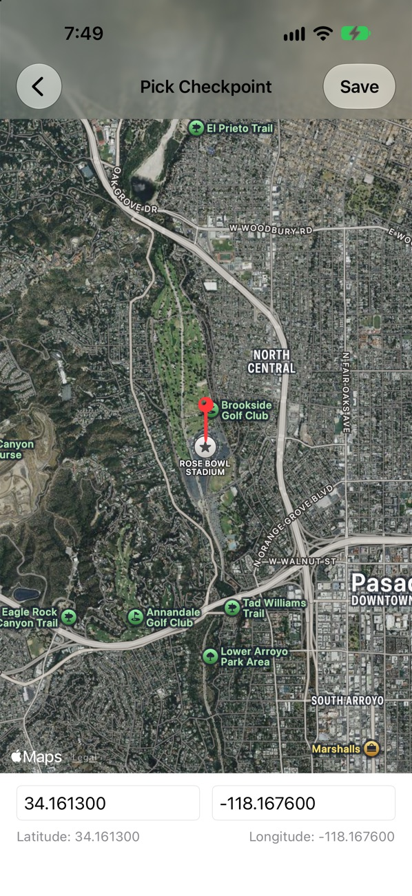
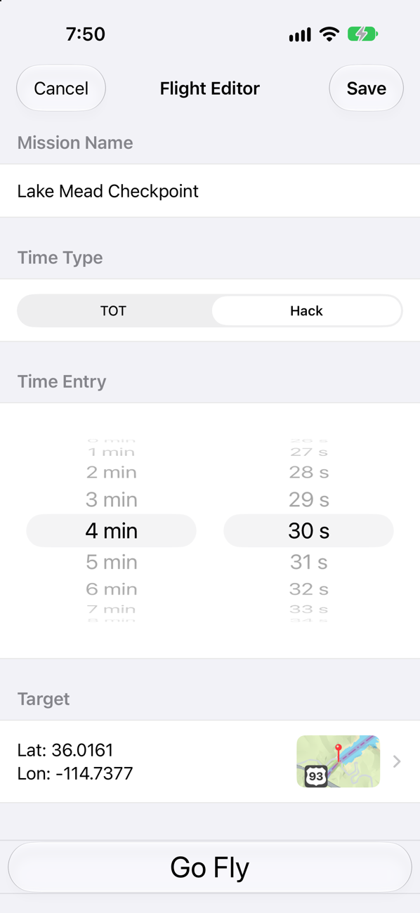
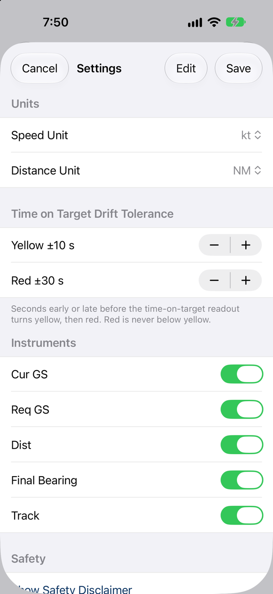

# Formation Flight

**Hit the mark at the exact second you mean to.** Formation Flight is a free iPhone and iPad app for GA pilots who need to be over a point at a specific time: a flyover at a ballgame, a pass over a parade, or an arrival timed to the music on the ground.

<!-- When the app is approved, replace the next line with the App Store badge and link. -->
**Coming soon to the App Store.** Free, with no ads, no account and no in-app purchases.

  

## Why I built this

My brother flies with a group of friends, and eight to ten times a year they do flyovers for community events. They fly the Fourth of July parade, the county fair opening ceremony, Memorial Day at the veterans' cemetery, and a Friday night homecoming game. Usually somebody on the ground is playing music, and the whole point is for the formation to come over the crowd right on the last note of the anthem.

He was doing it with a stopwatch, a kneeboard and some mental math. On a good day he'd be within about 20 seconds. That sounds close, but when the music has already ended and the crowd is looking at an empty sky, 20 seconds feels like a very long time.

He asked if I could build something that would just tell him whether he was early or late and how fast he needed to go to fix it. Formation Flight is that app. Now he's crossing the mark within a second or two.

## What it does

Set a target and a time, then fly. Formation Flight uses your device's GPS to give you the numbers that matter, in big type you can read at a glance.

- **Early or late, to the second.** Time, ETE, ETA, and your Δ against the time on target. The readout turns yellow and then red at tolerances you choose.
- **The speed that fixes it.** Your current groundspeed next to the groundspeed you need to make the time.
- **Where the target is.** Distance and bearing to the target, plus your current track.
- **Realistic ETE.** The estimate includes a standard-rate turn onto the target, so it's honest even before you're pointed at it.
- **Time on target or hack.** Fly to a clock time, or press Hack! and fly to a countdown, for when the ground crew calls "two minutes" over the radio.
- **Change plans in the air.** Edit the time on target mid-flight when the event runs late (it always runs late).
- **Made for the cockpit.** Light and dark modes, high-contrast readouts, and the screen stays awake while a flight is active.

  
  
  

### Plan it on the ground

Save your flights ahead of time. Drop a pin on a satellite map or type the coordinates, pick a clock time or a hack countdown, and the flight is ready on the ramp. When you're ready, tap **Go Fly**.

  
  

### Set it up your way

Choose knots, mph or km/h, and nautical miles, statute miles or kilometres. Set how many seconds early or late counts as yellow and red, and hide any instruments you don't want on screen.

### Private by design

There's no account and no network access, and no data is collected. Your location is used only while the app is open and never leaves your device.

## What's next

I'm working on:

- **Voice callouts.** Short, radio-style announcements so you can keep your eyes outside.
- **An Apple Watch companion.** Your timing on your wrist, with haptic taps you can feel without looking.
- **Notifications.** Reminders so you don't miss your window.

If there's something you'd like to see, [tell me](https://github.com/ellisandy/FormationFlight/issues).

## Safety

Formation Flight is a situational-awareness aid only. It is not a certified navigation system, and it doesn't replace your aircraft's instruments, charts or clearances. Fly the airplane first.

## Support

- Report a problem or ask a question: [GitHub Issues](https://github.com/ellisandy/FormationFlight/issues)
- Email: jack@mnmlst.cc
- Source code: [github.com/ellisandy/FormationFlight](https://github.com/ellisandy/FormationFlight)

## Privacy

Everything stays on your device. Location is used only while the app is open and is never stored or transmitted. The full statement is in the [privacy policy](privacy/).
